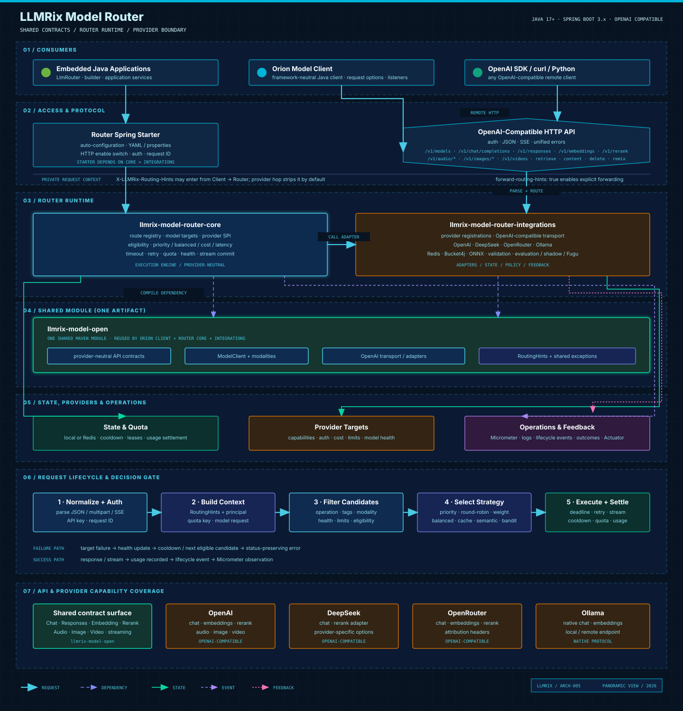

<h1 align="center">LLMRix Model Router</h1>
<p align="center">
  <strong>A production-oriented multi-model routing and orchestration framework for Java.</strong>
</p>
<p align="center">
  <em>OpenAI · DeepSeek · OpenRouter · Semantic routing · Contextual bandits · Fugu orchestration</em>
</p>
<p align="center">
  <a href="https://github.com/llmrix/llmrix-router/stargazers"></a>
  <a href="https://github.com/llmrix/llmrix-router/network/members"></a>
  <a href="./LICENSE"></a>
  <a href="#requirements"></a>
  <a href="docs/server.md"></a>
  
</p>
<p align="center">
  <a href="#why-llmrix">Why LLMRix</a> •
  <a href="#architecture">Architecture</a> •
  <a href="#modules">Modules</a> •
  <a href="#quick-start">Quick Start</a> •
  <a href="docs/server.md">Server</a> •
  <a href="docs/client.md">Client</a>
</p>
<p align="center">
  <a href="./README.md">English</a>
</p>

LLMRix exposes multiple model providers through one stable `ChatModel` interface. It selects an eligible model using capability, quality, cost, latency, quota, and health signals, then applies bounded retries and cooldown without leaking routing complexity into application code.

Use it as an embedded Java SDK, a Spring Boot starter, or an OpenAI-compatible routing service.

> Project status: General Availability (`1.0.0`). The Java API and configuration model are production-ready, with Semantic Versioning strictly enforced.

## Why LLMRix

- **Three first-class providers**: OpenAI, DeepSeek, and OpenRouter over one validated OpenAI protocol transport.
- **Policy separated from execution**: strategies rank model targets; the executor owns timeout, retry, quota, and cooldown correctness.
- **Streaming-safe candidate switching**: the router can try another configured model before output begins and never replays after output begins.
- **Local or distributed state**: zero-infrastructure local mode and Redis-backed health, leases, RPM, and TPM for multi-instance deployments.
- **OpenAI-compatible edge**: Chat, Responses, Embeddings, Audio, Images, Models, and SSE endpoints.
- **Framework-neutral client**: Orion provides a small Java client plus optional Spring Boot auto-configuration.
- **Observable by design**: lifecycle events, Micrometer metrics, Spring Observations, request IDs, and health indicators.
- **Composable advanced routing**: semantic routing, contextual bandits, online shadow traffic, evaluation, and Fugu-style iterative orchestration.

## Architecture

[Open the interactive HTML architecture](docs/architecture/index.html), or download the [SVG](docs/architecture/llmrix-architecture.svg).



The framework owns routing semantics and request correctness. Infrastructure remains responsible for TLS, WAF, load balancing, Redis HA, secret management, telemetry storage, and container orchestration.

## Modules

| Artifact | Responsibility |
|---|---|
| `llmrix-model-router-core` | Provider-neutral API, runtime facade and Builder, model targets, strategies, execution, state SPI, provider SPI, quota, health, and events. |
| `llmrix-model-router-integrations` | OpenAI protocol transport, default OpenAI/DeepSeek/OpenRouter registrations, Redis, Bucket4j, ONNX, evaluation, shadow, and Fugu adapters. |
| `llmrix-model-router-spring-starter` | Router properties, auto-configuration, OpenAI-compatible HTTP/SSE endpoints, HTTP authentication, request IDs, Actuator, Micrometer/Observation, and configuration metadata. |
| `llmrix-model-orion` | Lightweight framework-neutral Java client for the routing server. |
| `llmrix-model-orion-spring-starter` | Orion auto-configuration and Micrometer integration. |
| `llmrix-model-examples` | Maven aggregator for executable examples and module-scoped tests. Not a production dependency. |
| `llmrix-model-router-core-examples` | Core routing examples and tests. |
| `llmrix-model-router-integrations-examples` | Provider and infrastructure integration examples and tests. |
| `llmrix-model-router-spring-starter-examples` | Spring Boot starter, HTTP protocol, and observability tests. |
| `llmrix-model-router-server-examples` | Runnable standalone Spring Boot server example and launch smoke test. |
| `llmrix-model-client-examples` | Orion client and client starter tests. |

## Requirements

- Java 17 or later; Java 21 is recommended.
- Spring Boot 3.x when using either starter.
- Redis is optional and required only for shared multi-instance runtime state.

## Quick Start

### Maven

```xml
<dependency>
  <groupId>com.llmrix.model</groupId>
  <artifactId>llmrix-model-router-core</artifactId>
  <version>1.0.0</version>
</dependency>
<dependency>
  <groupId>com.llmrix.model</groupId>
  <artifactId>llmrix-model-router-integrations</artifactId>
  <version>1.0.0</version>
</dependency>
```

### Programmatic configuration

The same router can be built without Spring or YAML. The runtime Builder lives in Core; the integrations artifact registers the built-in OpenAI-compatible providers through the Core SPI. Integrations own provider credentials and may define multiple models:

```java
try (LlmRouter router = LlmRouter.builder()
        .integration("openai", integration -> integration
            .apiKey(System.getenv("OPENAI_API_KEY"))
            .model("gpt-4.1-mini", model -> model
                .capabilities(Capability.CHAT, Capability.TOOLS)))
        .integration("deepseek", integration -> integration
            .apiKey(System.getenv("DEEPSEEK_API_KEY"))
            .model("deepseek-chat", model -> model
                .capabilities(Capability.CHAT, Capability.TOOLS, Capability.CODE)))
        .route("general", route -> route
            .strategy("balanced")
            .models("openai/gpt-4.1-mini", "deepseek/deepseek-chat"))
        .build()) {
    ChatResponse response = router.chat("Review this Java code");
}
```

### Policy-based routing

```java
RoutedChatModel model = RoutedChatModel.builder()
    .target("reasoning", reasoningModel, target -> target
        .capabilities(Capability.REASONING, Capability.TOOLS)
        .inputCostPerMillion(1.25)
        .outputCostPerMillion(10.00))
    .target("fast", fastModel, target -> target
        .capabilities(Capability.CHAT, Capability.CODE)
        .inputCostPerMillion(0.27)
        .outputCostPerMillion(1.10))
    .strategy(Strategies.balanced())
    .timeout(Duration.ofSeconds(30))
    .maxRetries(1)
    .build();

ChatResponse response = model.chat(ChatRequest.builder()
    .userMessage("Find the race condition")
    .routingHints(RoutingHints.builder()
        .require(Capability.CODE)
        .maxCostUsd(0.05)
        .build())
    .build());
```

Applications can call synchronously, asynchronously, or as a `Flow.Publisher<ChatChunk>`. Text, images, input audio, tools, structured response formats, usage, finish reasons, and common generation options are represented by provider-neutral Core types.

## Routing Model

Every request follows one deterministic execution pipeline:

1. Validate the request and normalize routing hints.
2. Remove targets that violate capability, model, context, cost, quota, concurrency, or health constraints.
3. Rank eligible targets with the configured strategy.
4. Acquire runtime quota and concurrency leases.
5. Execute with a bounded per-attempt and total timeout.
6. Retry only retryable failures and only within the configured budget.
7. Mark failures, apply cooldown, and move to the next eligible model in the route pool.
8. Settle token usage, release leases, and publish lifecycle observations.

Built-in strategies include priority, round-robin, weighted random, balanced scoring, semantic scoring, and contextual bandit selection. Custom policies implement `RoutingStrategy`; custom runtime persistence implements `RouterStateStore` or `BanditStateStore`.

## Server Deployment and HTTP Usage

Server deployment, Spring Boot configuration, provider integrations, HTTP authentication, endpoint
catalog, startup commands, and curl examples are documented in [docs/server.md](docs/server.md).

## Client Usage

The Orion Java client, typed model operations, multimodal requests, asynchronous and streaming calls,
request options, and Spring Boot client starter are documented in [docs/client.md](docs/client.md).

## Reliability and Streaming

- Retry applies only to failures classified as retryable; after a failed attempt, the router may continue through the configured model pool.
- A streaming request may switch targets before its first chunk, never after data is visible to the caller.
- Cancellation propagates to the active target and releases runtime state.
- Tool-bearing requests must not be blindly replayed because tools may have side effects.
- Upstream HTTP status is retained on provider-domain exceptions; non-HTTP failures use `-1`.
- Online shadow execution is isolated by sampling, timeout, and concurrency limits and skips tool requests by default.

## Observability

Router and Fugu lifecycle listeners are the stable Core observability boundary. Optional Spring integration provides Micrometer counters/timers, first-token latency, Observation context, Actuator health, and request-ID correlation. Orion exposes its own dependency-free listener SPI and adapts it to Micrometer when used through Spring.

The framework emits telemetry but does not deploy Prometheus, Grafana, an OpenTelemetry Collector, or log storage.

## Fugu Orchestration

`FuguOrchestrator` implements iterative Candidate/Role selection for solver-reviewer and refinement workflows. It supports rule-based or ONNX policies, bounded turns, retry/fallback, optional shared cooldown state, and a lifecycle `Flow.Publisher`. The lifecycle stream represents orchestration events, not model token chunks.

Training, reward modeling, and policy rollout stay offline. Runtime policy manifests are versioned and validated before inference.

## Extension Points

| SPI | Use it to |
|---|---|
| `ChatModel` / streaming model contract | Provider-neutral internal routing contract. |
| `RoutingStrategy` | Implement business-specific target ordering. |
| `RouterStateStore` | Persist health, quota, and concurrency state. |
| `BanditStateStore` | Share contextual-bandit selections and rewards. |
| `ModelProvider` | Integrate a provider and its transport protocol. |
| `ProviderAuthenticator` | Add provider authentication mechanisms. |
| `ModelPricingResolver` | Resolve model pricing from configuration, a catalog, or a remote service. |
| Router/Fugu listeners | Export traces, metrics, audit events, or feedback. |
| `ApiKeyVerifier` | Connect HTTP authentication to external identity infrastructure. |

In Spring Boot, declare the SPI implementations as beans. The starter discovers them and contributes them to the same `LlmRouterBuilder` assembly pipeline:

```java
@Bean
ModelProvider acmeProvider() {
    return new AcmeModelProvider();
}

@Bean
ProviderAuthenticator signedRequestAuthenticator() {
    return new AcmeSignedRequestAuthenticator();
}

@Bean
ModelPricingResolver catalogPricingResolver() {
    return context -> pricingCatalog.find(context.providerId(), context.modelName());
}
```

A custom component with the same ID replaces the built-in implementation, which supports enterprise proxies, proprietary authentication, and internal pricing catalogs.

## Build and Test

```bash
mvn clean test
mvn package -DskipTests
```

`llmrix-model-examples` is a Maven aggregator; each Router or client production module has a corresponding `*-examples` child. Tests and executable examples live in those children and follow the production module boundaries. Redis integration tests require a real Redis instance; HTTP/SSE tests require permission to bind a local port. CI is expected to run both on Java 17 and Java 21.

Router modules use Lombok to generate ordinary Java-class boilerplate. Lombok is a `provided` compile-time annotation processor, is not propagated as a consumer runtime dependency, and is configured explicitly in Maven.

## Scope

LLMRix is a routing framework, not an API gateway, model host, training platform, secret manager, or infrastructure control plane. Deploy it behind Higress, APISIX, Nginx, or a cloud load balancer when gateway features are required. Provider keys should be supplied through the deployment environment or a managed secret store.

## Compatibility

The project follows Semantic Versioning. After `1.0`, public Java APIs, Maven coordinates, protocol behavior, and `llmrix.model.*` configuration remain backward compatible within a major line. Experimental APIs are explicitly documented and excluded from that guarantee.

## Contributing

Bug reports, feature requests, and pull requests are welcome — see [CONTRIBUTING.md](CONTRIBUTING.md) and [GIT_CONVENTIONS.md](GIT_CONVENTIONS.md). Please read the [Code of Conduct](CODE_OF_CONDUCT.md) before participating.

## Security

To report a vulnerability, follow the [Security Policy](SECURITY.md). Do not open a public issue.

## Changelog

Release history is maintained in [CHANGELOG.md](CHANGELOG.md).

## License

MIT License — see [LICENSE](LICENSE).
